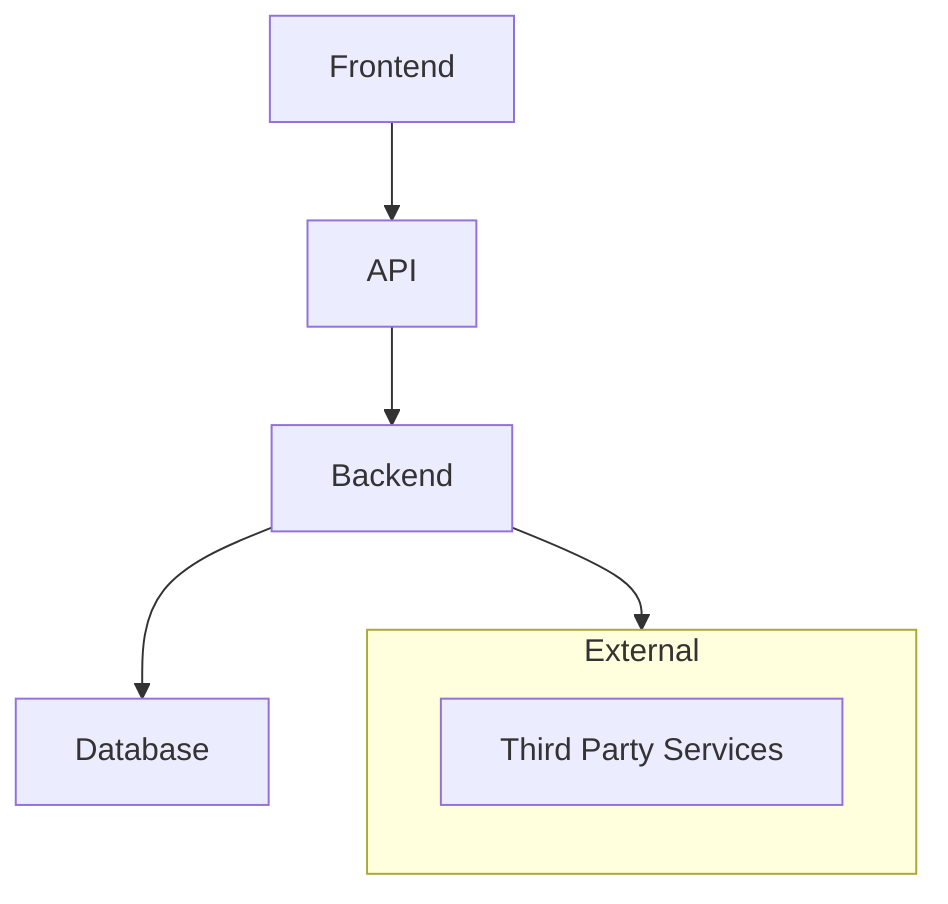
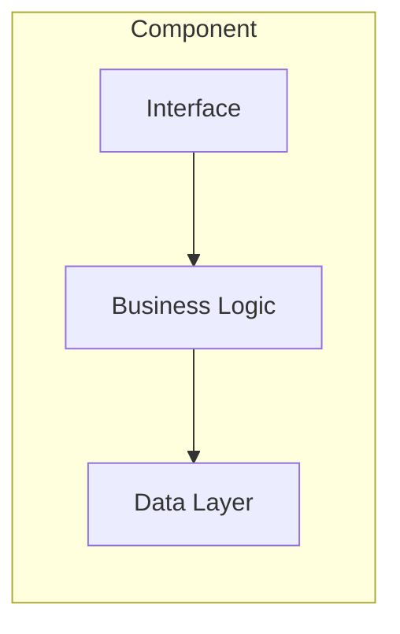
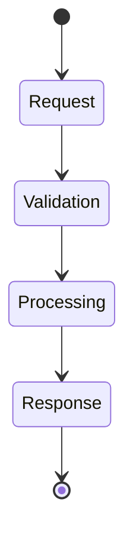
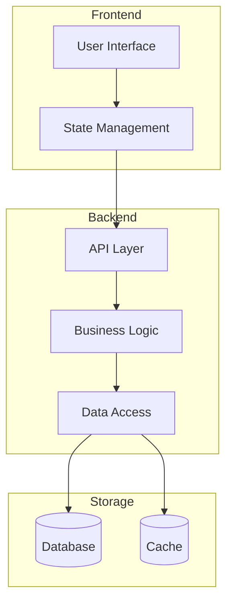
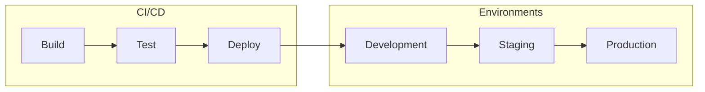

# Architecture Documentation Guidelines

## Overview
This document provides guidelines for creating and maintaining architecture documentation across projects, with a focus on using visual representations to enhance understanding.

## When to Create Architecture Documentation

Create or update architecture documentation when:
1. Designing new systems or components
2. Making significant architectural changes
3. Introducing new patterns or technologies
4. Documenting existing system architecture
5. Explaining complex workflows or processes

## Documentation Structure

### 1. High-Level Overview
Start with a high-level diagram showing major components and their relationships.



### 2. Component Details
Break down each major component into its constituent parts.



### 3. Process Flows
Document key processes and workflows.



## Using Mermaid Diagrams

### When to Use Diagrams
Create Mermaid diagrams to illustrate:
- System architecture and component relationships
- Data flows and process workflows
- State transitions and user journeys
- Decision trees and logic flows
- Deployment architectures
- Database schemas and relationships

### Diagram Types and Use Cases

1. **Flowcharts** (`flowchart` or `graph`)
   - System architecture
   - Component relationships
   - Process flows
   ```mermaid
   flowchart LR
       A[Start] --> B{Decision}
       B -->|Yes| C[Action 1]
       B -->|No| D[Action 2]
   ```

2. **Sequence Diagrams** (`sequenceDiagram`)
   - API interactions
   - Service communication
   - User interactions
   ```mermaid
   sequenceDiagram
       Client->>Server: Request
       Server->>Database: Query
       Database-->>Server: Response
       Server-->>Client: Response
   ```

3. **State Diagrams** (`stateDiagram`)
   - Workflow states
   - Application states
   - Process stages
   ```mermaid
   stateDiagram-v2
       [*] --> Active
       Active --> Pending
       Pending --> Complete
       Complete --> [*]
   ```

### Best Practices

1. **Clarity**
   - Keep diagrams focused and simple
   - Use clear, descriptive labels
   - Maintain consistent direction (left-to-right or top-to-bottom)
   - Group related elements using subgraphs

2. **Organization**
   - Place diagrams close to relevant text
   - Use progressive disclosure (high-level → details)
   - Include brief explanatory text with each diagram

3. **Maintenance**
   - Update diagrams when architecture changes
   - Version control diagrams with code
   - Use comments to explain complex parts
   - Keep styling consistent across diagrams

## Implementation Examples

### System Architecture


### Deployment Flow


## Conclusion
Well-structured architecture documentation with clear visual representations helps teams understand, maintain, and evolve systems effectively. Use these guidelines to create documentation that serves as a valuable resource for both current and future development efforts.

## Markdown Linting
To ensure consistency and readability across all documentation, use the standard markdown linting configuration.

### Setup Instructions

1. Copy the `.markdownlint.json` configuration file from this repository to your project:
```json
{
  "default": true,
  "MD001": true,
  "MD003": { "style": "atx" },
  "MD009": true,
  "MD012": { "maximum": 1 },
  "MD013": { "line_length": 120 },
  "MD022": true,
  "MD031": true,
  "MD040": true,
  "MD041": true,
  "MD033": false
}
```

2. Copy the GitHub Actions workflow from `.github/workflows/markdown-lint.yml` in this repository to enforce these standards in your CI/CD pipeline. This workflow serves as a template and can be customized for your specific needs.

### Key Rules

- Use ATX-style headers (#, ##, etc.)
- Maximum line length of 120 characters
- No multiple consecutive blank lines
- Code blocks must specify language
- HTML is allowed in markdown files
- Single newline between sections

### Local Development

To lint markdown files locally:

1. Install markdownlint-cli:
```bash
npm install -g markdownlint-cli
```

2. Run the linter:
```bash
markdownlint '**/*.md' --config .markdownlint.json
```
