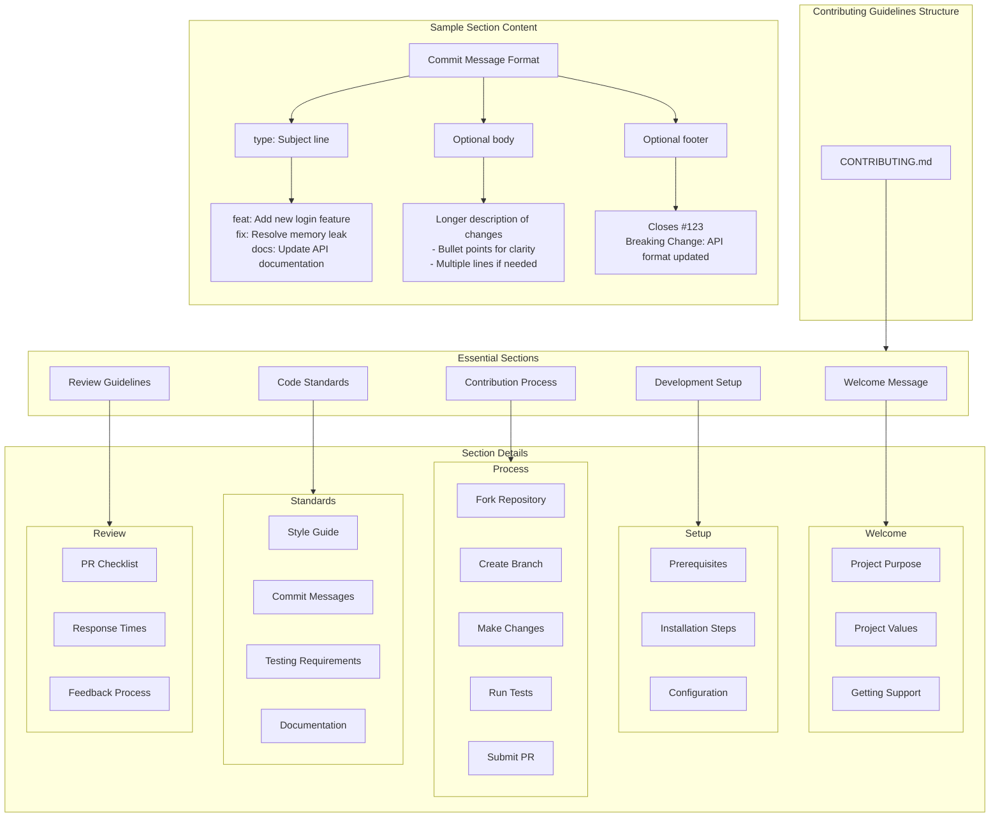

# Contributing Guidelines Architecture

This document outlines the structure and essential components of a `CONTRIBUTING.md` file for software projects. Use this as a template when creating contribution guidelines for new repositories.

## Architecture Overview



## Implementation Guidelines

### 1. Welcome Section
- Project overview with clear purpose
- Code of conduct reference
- Support channels (Discord, GitHub Issues, etc.)
- Links to important resources

### 2. Development Setup
- System requirements and prerequisites
- Step-by-step installation guide
- Configuration instructions
- Local development environment setup

### 3. Contribution Process
- Fork and clone instructions
- Branch naming conventions
- Making and testing changes
- Pull request submission process
- CI/CD pipeline overview

### 4. Code Standards
- Language-specific style guides
- Commit message format
- Code documentation requirements
- Testing coverage requirements

### 5. Review Guidelines
- Pull request template usage
- Review process overview
- Expected response times
- Handling feedback and iterations

## Example Implementation

Here's an example of how the commit message section might look in your CONTRIBUTING.md:

\```markdown
## Commit Messages

Follow this format for all commit messages:

\```
<type>: <subject>

[optional body]

[optional footer]
\```

Types:
- feat: New feature
- fix: Bug fix
- docs: Documentation only
- style: Code style/formatting
- refactor: Code changes that neither fix bugs nor add features
- test: Adding or updating tests
- chore: Maintenance tasks

Example:
\```
feat: Add user authentication system

- Implement JWT token generation
- Add password hashing
- Create login/logout endpoints

Closes #123
Breaking Change: Updated auth header format
\```
\```

## Customization Notes

1. Adapt sections based on project needs
2. Include language/framework specific requirements
3. Add examples relevant to your tech stack
4. Update review process based on team size
5. Modify checklist items for your workflow

Remember to:
- Keep instructions clear and concise
- Provide examples for complex procedures
- Include links to additional resources
- Update regularly based on team feedback
