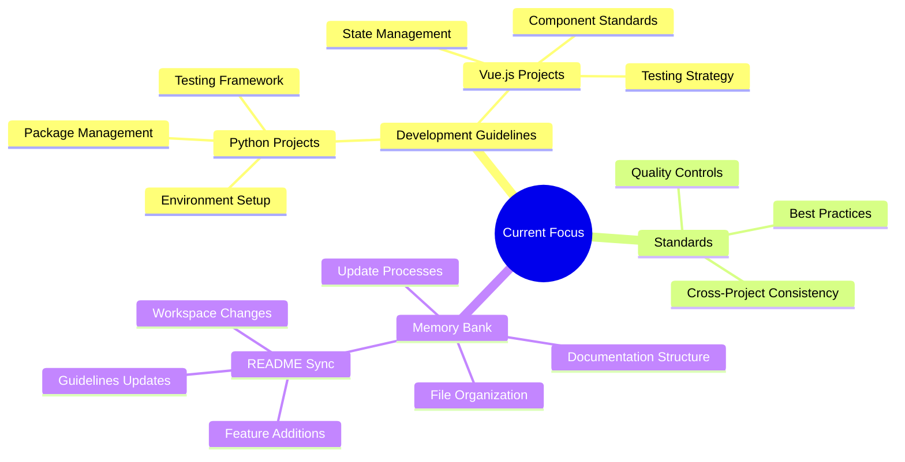
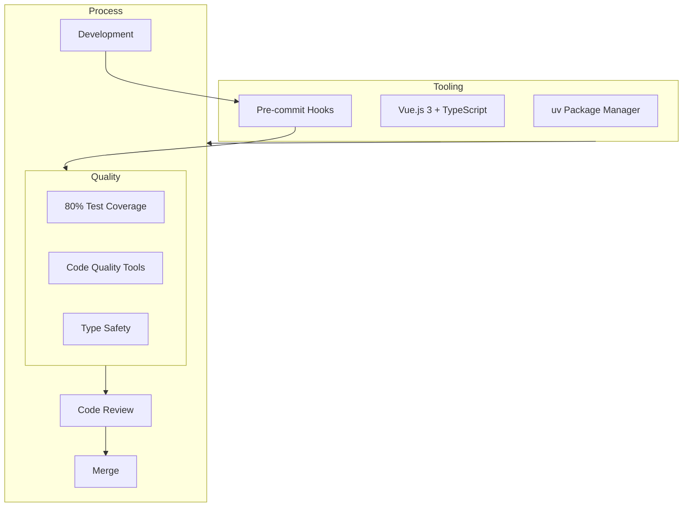
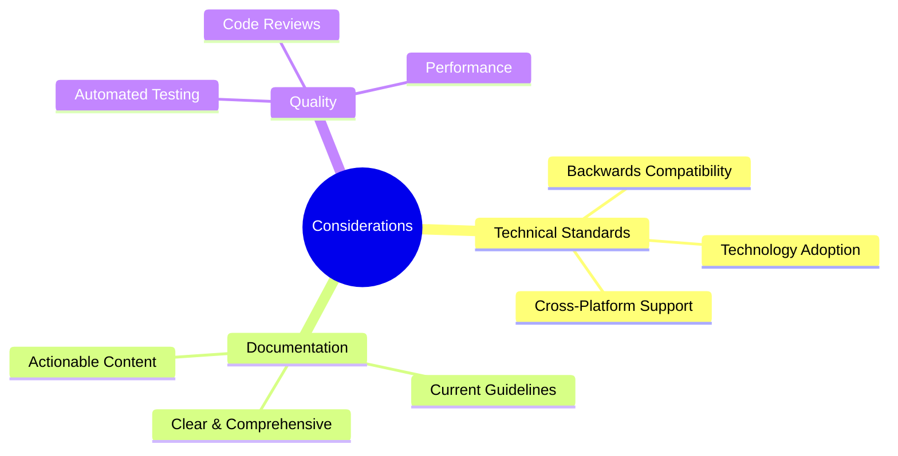
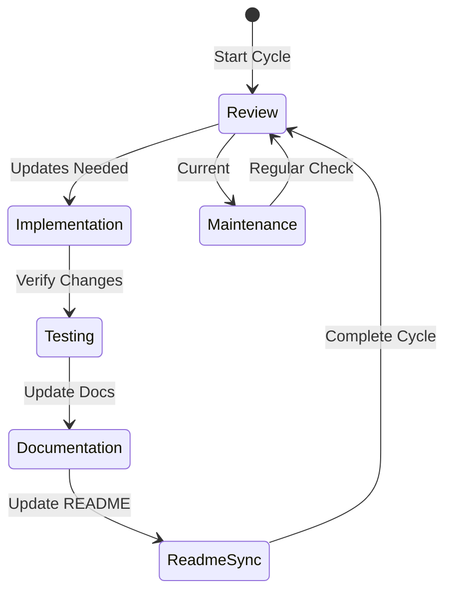
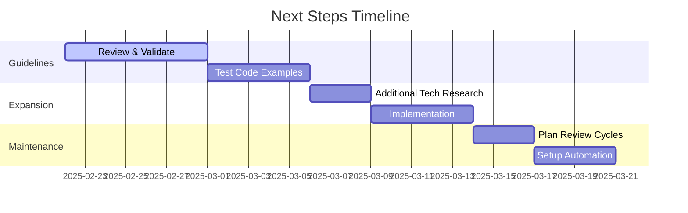

# Active Context

## Current Focus

## Recent Changes
1. Added Contributing Guidelines Architecture
   - Created comprehensive documentation template
   - Added Mermaid diagram for visualization
   - Included practical examples and implementation notes

2. Reorganized project structure
   - Created organized guidelines directory structure
   - Separated guidelines by domain (frontend, backend, devops, shell)
   - Added assets directories for each domain
   - Restructured architecture documentation

2. Created Python development guidelines
   - Environment setup with Python 3.11+
   - uv as package manager
   - Testing with pytest
   - Code quality tools (Black, isort, Ruff)

2. Enhanced Vue.js guidelines
   - Added testing requirements
   - Expanded component guidelines
   - Detailed state management practices
   - Error handling standards

3. Established memory bank structure
   - Created core documentation files
   - Defined file organization
   - Set documentation standards

## Active Decisions and Workflow

## Current Considerations

## Review and Implementation Cycle

## Immediate Next Steps

