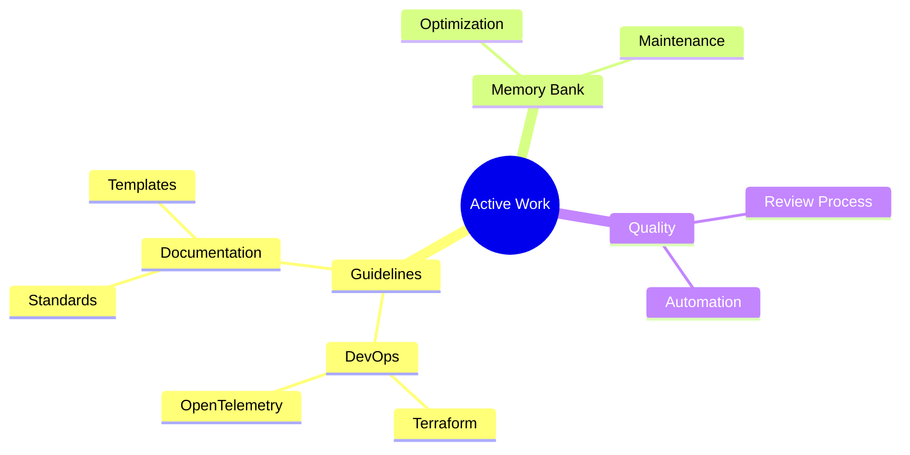
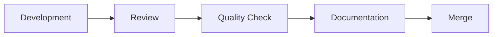

# Active Context

## Current Focus

## Recent Changes
1. Added DevOps Guidelines
   - Created Terraform guidelines for IaC
   - Added GitHub Actions workflows
   - Implemented OpenTelemetry observability standards
   - Created Docker containerization best practices
   - Added Docker Compose service orchestration
   
3. Added Backend Framework Architecture Guidelines
   - Created .NET architecture guidelines with clean architecture focus
   - Added Django guidelines with app-based structure
   - Implemented FastAPI guidelines with async-first approach
   - Included practical code examples and patterns for each

4. Added Contributing Guidelines Architecture
   - Created comprehensive documentation template
   - Added Mermaid diagram for visualization
   - Included practical examples and implementation notes

5. Reorganized project structure
   - Created organized guidelines directory structure
   - Separated guidelines by domain (frontend, backend, devops, shell)
   - Added assets directories for each domain
   - Restructured architecture documentation

6. Created Python development guidelines
   - Environment setup with Python 3.11+
   - uv as package manager
   - Testing with pytest
   - Code quality tools (Black, isort, Ruff)

7. Enhanced Vue.js guidelines
   - Added testing requirements
   - Expanded component guidelines
   - Detailed state management practices
   - Error handling standards

8. Established memory bank structure
   - Created core documentation files
   - Defined file organization
   - Set documentation standards

## Development Workflow

## Current Priorities
1. Memory Bank Optimization
   - Remove redundant information
   - Simplify complex diagrams
   - Ensure clear documentation flow

2. Documentation Standards
   - Update templates
   - Streamline guidelines
   - Enforce consistency

3. Quality Assurance
   - Review processes
   - Automation improvements
   - Testing standards

## Next Actions
1. Complete memory bank optimization
2. Update documentation templates
3. Implement automated quality checks
4. Review and validate recent changes
