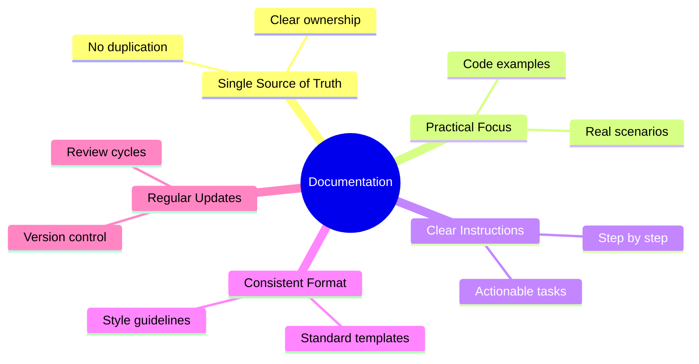
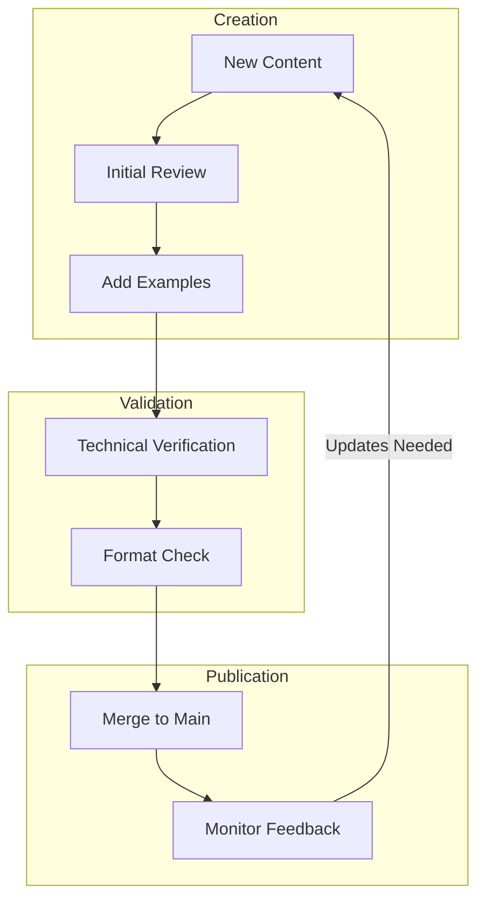
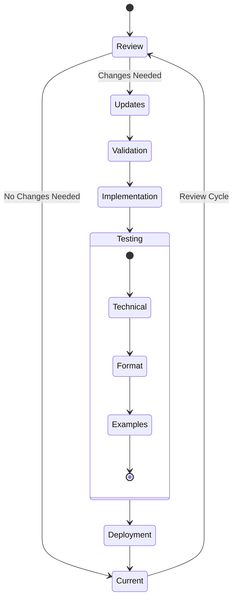
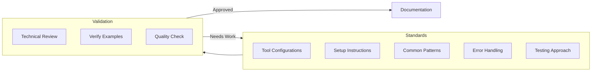

# System Patterns

## Documentation Structure
- Technology-specific guideline files (e.g., frontend.md, python.md)
- Clear section organization within each file
- Code examples for concrete implementation
- Comprehensive coverage of tools and best practices

## File Organization
```
project-requirements/
├── memory-bank/          # Project context and status
│   ├── projectbrief.md
│   ├── techContext.md
│   ├── systemPatterns.md
│   ├── progress.md
│   └── activeContext.md
├── guidelines/           # Technology-specific guidelines
│   ├── frontend/        # Frontend development
│   │   ├── vue.md
│   │   └── assets/     # Frontend-specific resources
│   ├── backend/         # Backend development
│   │   ├── python.md
│   │   ├── postgres.md
│   │   └── assets/     # Backend-specific resources
│   ├── devops/         # DevOps and infrastructure
│   │   ├── kubernetes.md
│   │   └── assets/     # DevOps-specific resources
│   └── shell/          # Shell scripting
│       ├── bash.md
│       └── powershell.md
├── architecture/        # Architecture documentation
│   ├── principles/     # Architecture principles
│   │   ├── general_principles.md
│   │   └── solid_principles.md
│   └── assets/         # Architecture diagrams
└── README.md           # Project overview
```

## Guidelines Pattern
Each technology guideline includes:
- Environment setup
- Code quality tools
- Testing requirements
- Project structure
- Best practices
- Security considerations

## Documentation Principles


## Documentation Flow


## Maintenance and Quality Control


## Implementation Standards

