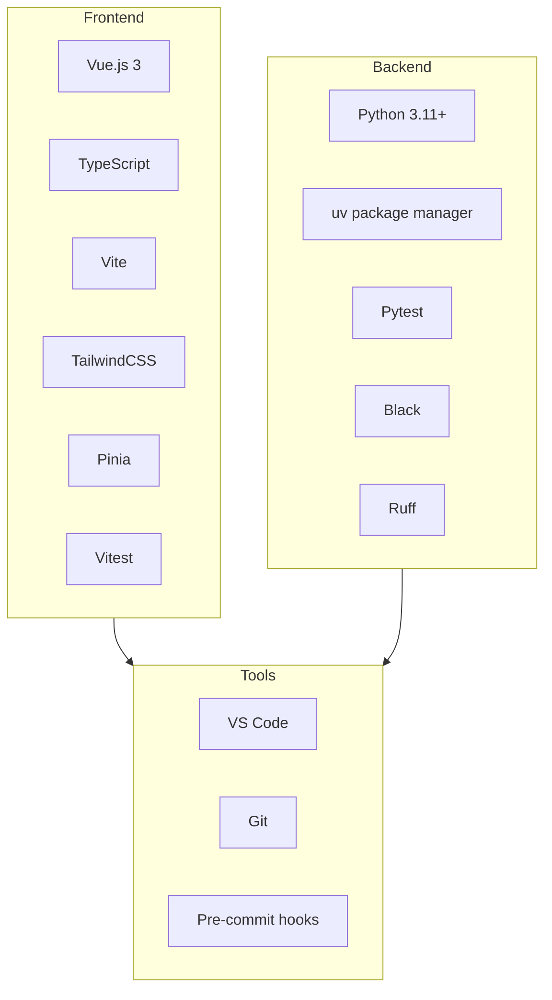

# Technical Context

## Technology Stack Overview

## Current Technology Stack

### Frontend (Vue.js)

- Vue.js 3 with TypeScript
- Vite for build tooling
- TailwindCSS for styling
- Pinia for state management
- Vitest for testing

### Backend (Python)

- Python 3.11+
- uv for package management
- pytest for testing
- Black/isort for formatting
- Ruff for linting

### Documentation

- Markdown format
- markdownlint for style enforcement

## Development Environment
- VSCode IDE
- Git with pre-commit hooks

## Project Standards
1. Configuration
   - pyproject.toml (Python)
   - tailwind.config.js (Frontend)
   - .markdownlint.json (Documentation)

2. Quality Requirements
   - 80% test coverage minimum
   - Automated linting/formatting
   - Type safety
   - Regular updates
