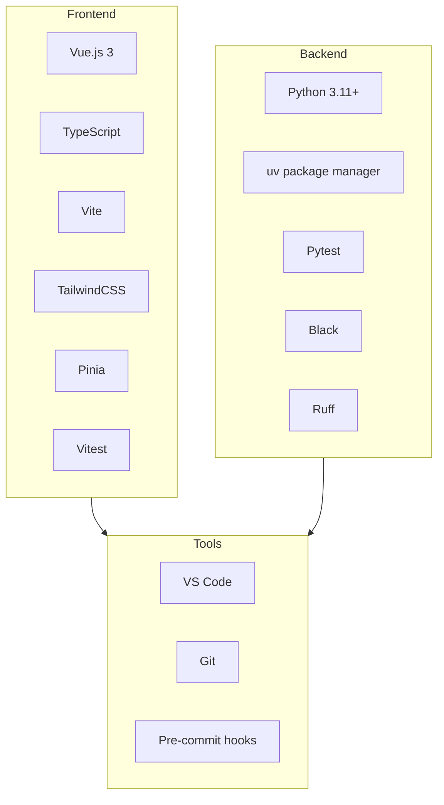
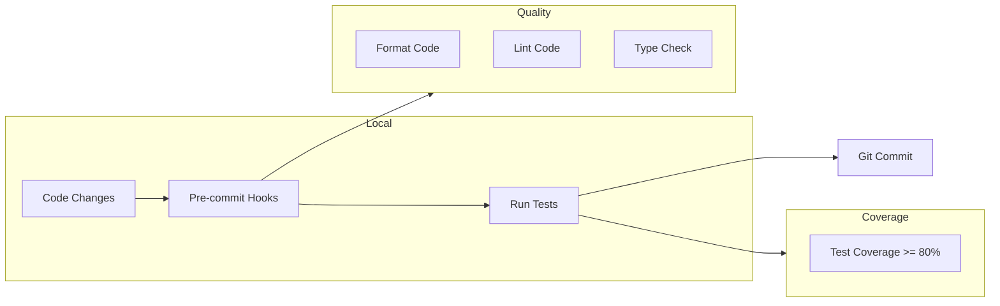

# Technical Context

## Technology Stack Overview

## Current Technology Stack

### Frontend (Vue.js)
- Vue.js 3 with TypeScript
- Vite for build tooling
- TailwindCSS for styling
- Pinia for state management
- Vitest for testing

### Backend (Python)
- Python 3.11+
- uv for package management
- pytest for testing
- Black/isort for formatting
- Ruff for linting

### Documentation
- Markdown format
- markdownlint for style enforcement

## Development Workflow

## Development Tools
- VSCode as primary IDE
- Pre-commit hooks for code quality
- Version control with Git

## Configuration Standards
- Use of pyproject.toml for Python projects
- Tailwind config for frontend styling
- Consistent formatting rules across projects

## Quality Assurance
- Minimum 80% test coverage requirement
- Automated linting and formatting
- Type safety enforcement
- Regular dependency updates
